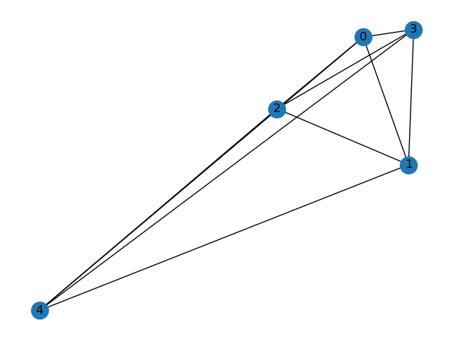
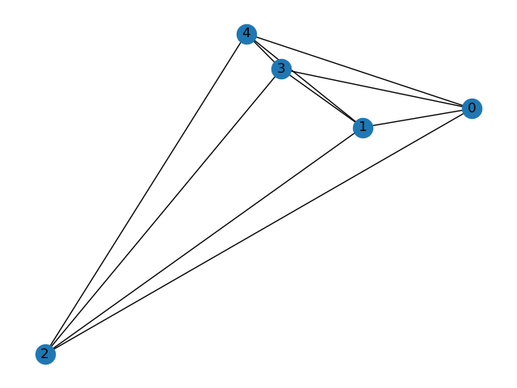

# Egnn Visualizations of orignal experiments

| name | 0 | 1 | 2 |
|---|---|---|---|
|origin graph|  |  |  |
|origin graph rotation|  |  |  |
|origin graph after egnn|  |  |  |
|rotating on origin graph after egnn| |  |  |
| after egnn manual rotating results|  |  |  |
