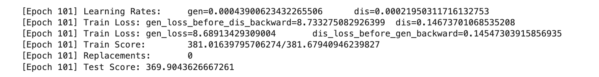

## Debug SmartGD

### Attempts

**key change**: adjust discriminator readout, using node features instead of coordinates.

This is inspired by SmartGD using a new oneslike node feature.

**other adjustment**:
- set discriminator lr to half of generator lr(trying many lr values).
- adjust aggr func from mean to sum
- let edge_feat read coords instead of node_feat

- (tried but not enabled) different step size
- (tried but not enabled) adjust discriminator's depth

### Results

Use pmds as real layout, generator can generate a compatitable layout compared to pmds.

## HRCP

### What problem the paper solved

1. previous nueral network based work is limited to the structure immediately around a node.
2.  non-convex optimization goal

### Algorithm: HARP

1. Graph Coarsening
2. Graph Embedding on the Coarsest Graph 
3. Graph Representation Prolongation and Refinement
4. Graph Embedding of the Original Graph

### Coarsening Method

- star coarsening
- edge coarsening

### Thoughts

1. Similar to mutilevel method in traditional method
2. How to do graph coarsening(what coarsening method should be applied)

## Visualization