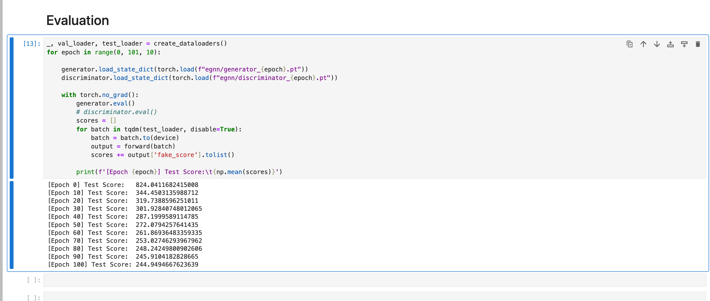

## Ablation Study
### SmartGD original


### SmartGD with Egnn


### Conclusion
Adding Egnn does improve the ablility of SmartGD model to a slight extent. Plus, this enables our discriminator to be equivarient to translation and rotation, increasing the stablity of the model.

The fake logit of discriminator stay consistant when rotating:

|before rotate for fake|after rotate for fake|before rotate for real|after rotate for real|
|--------------|----------|------|-------|
|-388.0|-388.0|-592.6|-592.6|

But when rotateing the init_pos of generator, the result is not ok.

|after rotate for fake|after rotate for real|
|--------------|----------|
|-388.3|-592.6|

The reason why fake logits is better than real logits: fake score is smaller than real logit, meaning real pos should be replaced.

## EGNN property

### Modification on original egnn code

[See more details in another file: EGNN](../Egnn/visual.md)

**Conclusion:** Both node embedding h and coordinates x should be equivalent.

### Problems in DeepGD+Egnn

Then edge feature router breaks the eqivariance. 

Previously I thought the reason is taht edge feature router takes in node feats. But as node feats is equvariant, the edge feature should be equivarant. So further experiments should be conducted to see what is the problem.

```python
# previously at Egnn_DeepGD/deepgd/model/generator_layer.py, line 93
# or view DeepGD/deepgd/model/generator_layer.py, line 95

edge_feat=self.edge_feat_provider(
                node_feat=node_feat,
                edge_index=edge_index,
                edge_attr=edge_feat
            ),
```

After dismissing edge feature router, the result is as follows:

[See more details in another file: EGNN_DeepGD](../Egnn_DeepGD/visualization/visualization.md)

Despite slight difference, the coordinates is equivalent. Also we can see that node embedding is equivalent too:

```python
# node embedding without rotate

[-266.9105,  226.7525, -412.9301,  233.6808,   48.2025, -286.9818,
    10.1934,  438.4936,  -19.2508, -357.5196,    0.6735, -130.2048,
    474.1271, -405.1861,  -22.0683,  -22.4794]

# node embedding with rotate

[-266.4881,  226.5062, -412.7366,  233.2891,   48.1764, -287.3294,
    10.7125,  438.2541,  -19.1732, -357.6890,    0.6993, -130.2178,
    473.8825, -405.5237,  -22.7127,  -22.7274]
```

The slight difference may be due to the loss of precision as the model is deep.

### Thoughts about scalability

[See more details in another file: Scalability](./scalability.md)

