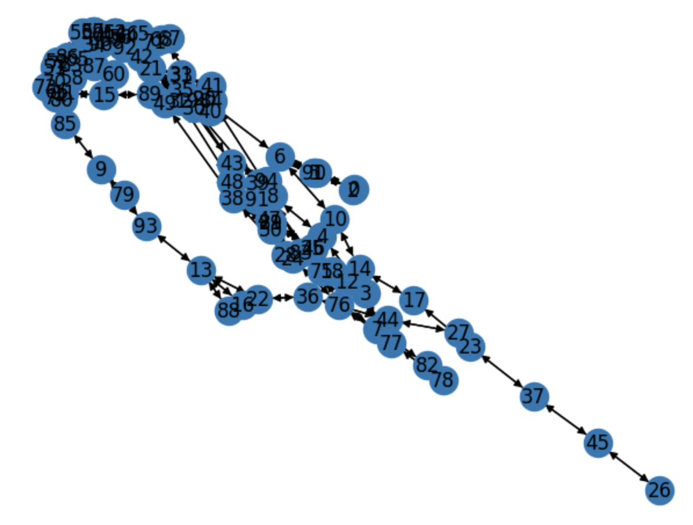
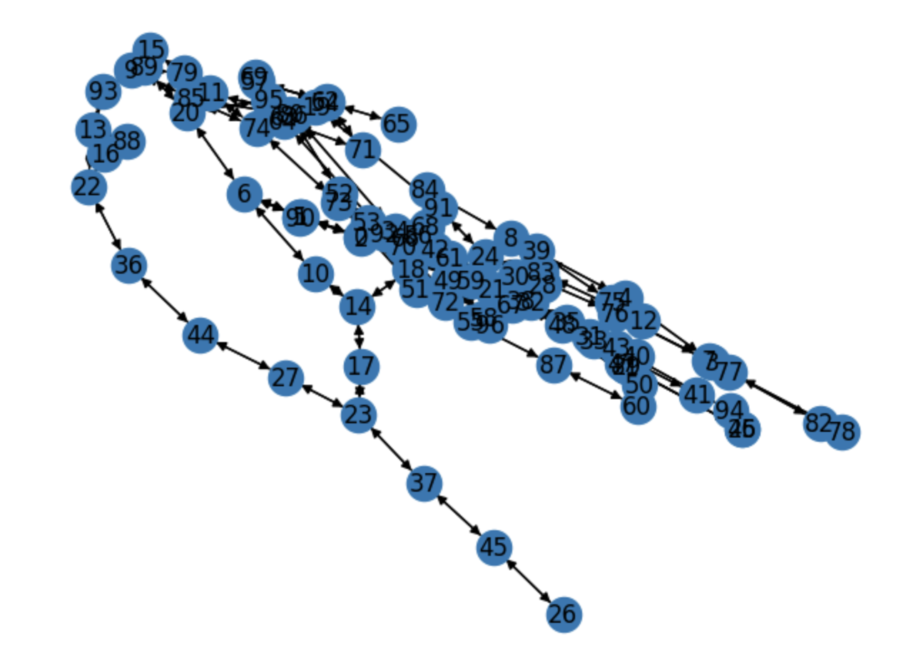
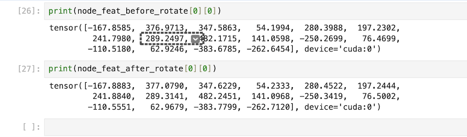
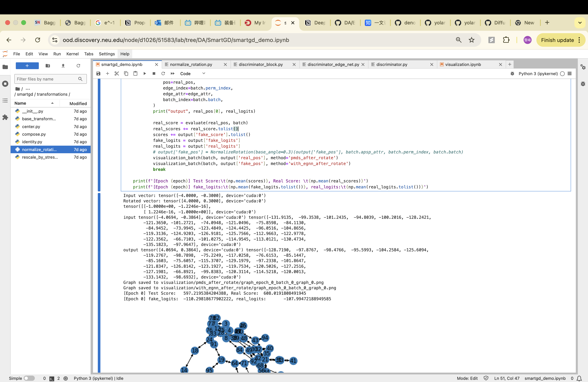
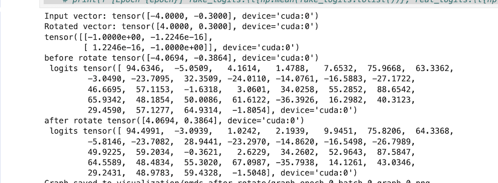

## Further Study about equivalent property

### Fix error about last week update

**Why egnn_deepgd seems not equivalent: Wrong Rotation Method**
```python
# should be used with center
outer = torch.einsum('ni,nj->nij', pos, pos)
cov = scatter(outer, batch_index, dim=0, reduce='mean')
components = torch.linalg.eigh(cov).eigenvectors
return torch.einsum(
    'ij,njk,nk->ni',
    self.base_rotation.to(pos.device),
    components[batch_index],
    pos
).float()

```
Now has changed to right one:

```python
rotation_matrix = torch.tensor([
    [torch.cos(angle), -torch.sin(angle)],
    [torch.sin(angle), torch.cos(angle)]
], dtype=torch.float32)
rotation_matrix = rotation_matrix.to(device)
```

Now the correct visualization:
[See more details in another file: EGNN_DeepGD](../Egnn_DeepGD/visualization/visualization.md)
### In DeepGD

|Description|info|image|
|---|---|---|
|Without egnn at Epoch 0 before rotate|Test Loss: 1587.314697265625| |
|Without egnn at Epoch 0 after rotate|Test Loss: 1650.787353515625||
|Without egnn at Epoch 100 before rotate|Test Loss: 410.3||
|Without egnn at Epoch 100 after rotate|Test Loss: 410.7||

Node embeddings:


- **Observation 1:**
If DeepGD is fully trained and stress is used as metric, then Rotation and Translation does not affect the model a lot. But at the beginning of training process, stress is apprently affected. This suggest that since DeepGD is trying to optimize stress, it is somehow robust against different input, but it is not equvalent.

- **Observation 2:**
With Rotation and Translation, the generated Graph is different, which may affect human preferance.

- **Observation 3:**

With EGNN, both the coordinates and node embeddings of the generated graph is equivalent to rotation, trasnlation during the whole process.

### In SmartGD
Tensor Rotation and Logits Data:

1. epoch 0:


2. epoch 70:


3. egnn

- Before Rotation

**Tensor:** `tensor([-4.0694, -0.3864], device='cuda:0')`

**Logits:**

```
tensor([[-5786.9927], [-349.3514], [-849.5824], [-302.6874], [-1519.6061], [-4645.7075], [-4136.6196], [-510.9449], [-123.8733], [-3291.5369], [-139.2435], [-186.4621], [-20.2010], [-60.5828], [-3559.6514], [-5106.5552], [-351.7480], [-1376.1837], [-3040.9116], [-4923.7881], [-5098.3032], [-4313.2168], [-3095.6304], [-4798.0884], [-4818.7183], [-62.5707], [-1365.5787], [-3372.8420], [-2487.1699], [-4885.4937], [-5510.7441], [-510.2511]], device='cuda:0')
```

- After Rotation

**Tensor:** `tensor([4.0694, 0.3864], device='cuda:0')`

**Logits:**

```
tensor([[-5786.9927], [-349.3513], [-849.5823], [-302.6873], [-1519.6060], [-4645.7075], [-4136.6191], [-510.9450], [-123.8733], [-3291.5371], [-139.2435], [-186.4621], [-20.2010], [-60.5828], [-3559.6516], [-5106.5562], [-351.7480], [-1376.1840], [-3040.9126], [-4923.7886], [-5098.3032], [-4313.2178], [-3095.6299], [-4798.0859], [-4818.7153], [-62.5707], [-1365.5785], [-3372.8406], [-2487.1704], [-4885.4922], [-5510.7432], [-510.2510]], device='cuda:0')
```


## Scalablity papers

(Graph Coarsening with Neural Networks)https://arxiv.org/abs/2102.01350

### Diffusion Model

- In process